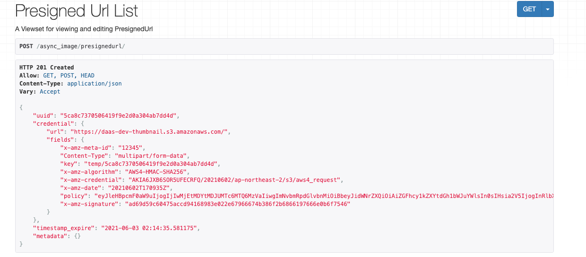
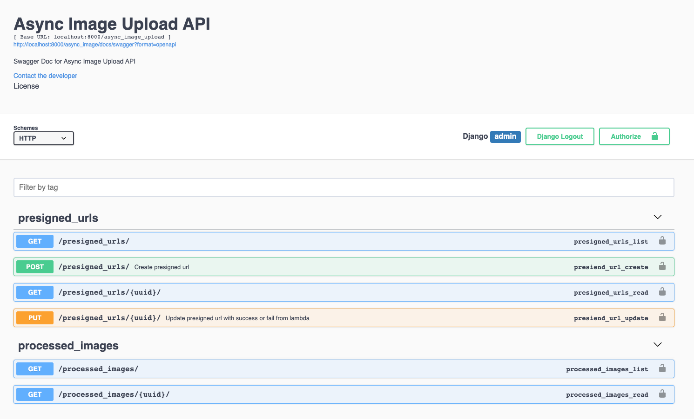
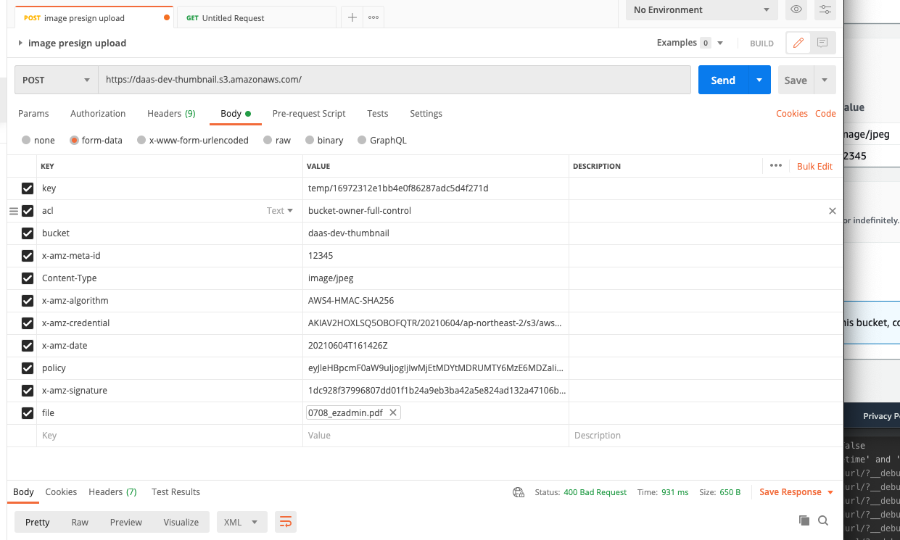

# Django-async-image-upload

Async image upload using presigned url for Django.

This module provide async processing capability using cloud architecture. 
With this you can decouple code from Django api server and easily extend image processing capability.

There are already plenty of good thumbnail packages such as [sorl-thumbnail](https://github.com/jazzband/sorl-thumbnail), 
[django-imagekit](https://github.com/matthewwithanm/django-imagekit).
However most of the packages process image on django server. Some are partially asynchrounous with celery and other technique, but server still needs to recieve files from client to proecess them.

Using S3(and others storages in the futures) presigned-url feature, client can directly uploads to S3 without involving backend server.
Once image is uploaded, api server gets callback once image processing in finished elsewhere(serverless function in this case.

Current version only provide asynchronous upload with lambda function. There are a lot more to do with this module.
- separate sam module with this package 
- automate sam deployment with one command with prompt 
- Unittest and github action 
- Multiple presigned url creation 
- Lambda in VPC if function needs to communicate resources in VPC. NAT support for callback
- Monitoring and alert 
- Decouple S3 Event trigger with lambda with SNS or EventBridge
- Hookup aws rekognition or other vision service for image metadata 
- GCP signed url and cloud function 
- Azure shared Access Signature(SAS) with Azure function
- Support for Django 2.X (Jsonfield)

# Architecture (AWS version)

1. Client request for `presigned url` for image upload.
2. Server generate [Presigned URL](https://docs.aws.amazon.com/AmazonS3/latest/userguide/PresignedUrlUploadObject.html) for upload. 
3. Server returns presigned url credential. 
4. Client uploads files in multipart/form with credential.
5. As soon as file is created on s3 bucket, lambda is triggered for image processing.
6. Lambda calls api server for callback for success or failure.

Refer to [sequence diagram](resources/sd.png) for more detail.

## Requirements
Because this module supports native django json fields,
- Django 3.1 and up
- Python 3.6 and up
- DB: MariaDB 10.2.7+, MySQL 5.7.8+, Oracle, PostgreSQL, and SQLite

## python packages
- djangorestframework
- drf-yasg
- boto3

# Instruction 
## Cloud module
You need to deploy cloud module(storage and serverless function) first. 
I provided SAM tempalte to automate deployment. Refer to following page for detailed instruction.
[Cloud module](cloud.md)

## Django API Module

Install Django-async-image-upload::

    pip install django-async-image-upload

Add it to your INSTALLED_APPS::

    INSTALLED_APPS = (

        'django_async_image_upload.apps.AsyncImageUploadAppConfig',

    )

Add Django-async-image-upload's URL patterns::

    from django_async_image_upload import urls as django_async_image_upload_urls
    
    urlpatterns = [
        url(r'^', include(django_async_image_upload_urls)),
    ]
    

# Settings
Available settings are:

`ASYNC_IMAGE_UPLOAD_BUCKET` 
- name of bucket where presigned url is generated
- default: None

`ASYNC_IMAGE_UPLOAD_TEMPORARY_IMAGE_PATH`
- folder path where image is uploaded using presigned url
- default: "temp/" 

`ASYNC_IMAGE_UPLOAD_PRESIGNED_URL_EXPIRATION`
- Presigned url expiration in second
- default: 1000

`ASYNC_IMAGE_UPLOAD_PRESIGNED_URL_REUSE_WINDOW`
- Time in second where you can reuse already generated presigned url 
- default: 30

`ASYNC_IMAGE_UPLOAD_PRESIGNED_URL_CONTENT_LENGTH`
- Max size of image in byte
- default: 10485760 # 10MiB

`PROCESSED_IMAGE_MODEL` 
- Image model that will be created when success callback is issued.  
- default: "ProcessedImage"

`AWS_ACCESS_KEY_ID` and `AWS_ACCESS_KEY_SECRET`
- Assuming you are already using Boto3, you need to set following AWS credentials

## Create presigned url 
POST to `/async_image/presignedurl/` to generate presignedurl credential.

### Swagger
For more information regarding api, you can access swagger on http://<host>/async_image/docs/swagger?format=openapi

## Upload image file to bucket
Client can use multipart/form upload to given url and fields in credential in with image file to upload to s3 bucket.

Order of the key matters, I recommend you to send in order of "key, acl, x-amz-meta-id... file".

## Checkup 
Because of the nature of the async operation, you won't be able to find out the result of the upload.
You can use following options.

1. Long polling - GET request to `/async_image/presignedurl/<uuid>` for completion. 
2. Open connection with sever using technics such as websocket, graphql.
3. Assume operation is successful workaround it.

It's your choice.

## Extra note
If you are deploying on EC2, your EC2 should have appropriate IAM credential or EC2 role with `s3:putOject` permission on particular bucket.

Running Tests
-------------
TBD

Development commands
---------------------

Credits
-------

Tools used in rendering this package:

*  [Cookiecutter](https://github.com/cookiecutter/cookiecutter)
*  [cookiecutter-djangopackage](https://github.com/pydanny/cookiecutter-djangopackage)
