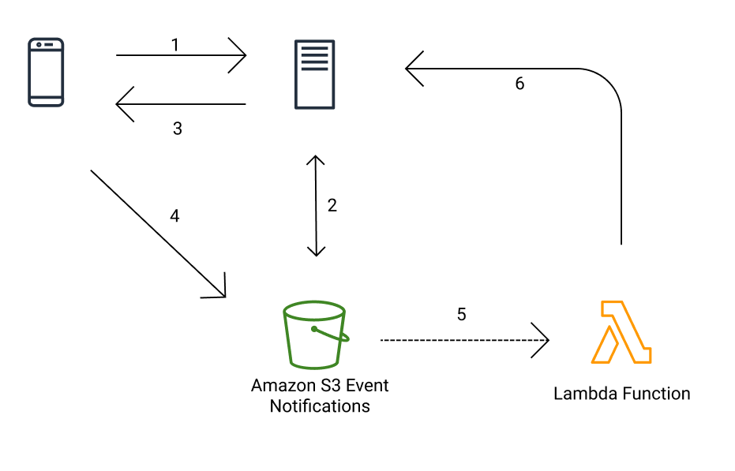
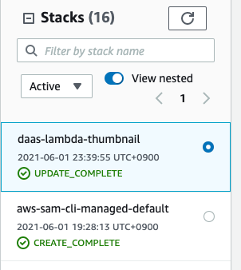
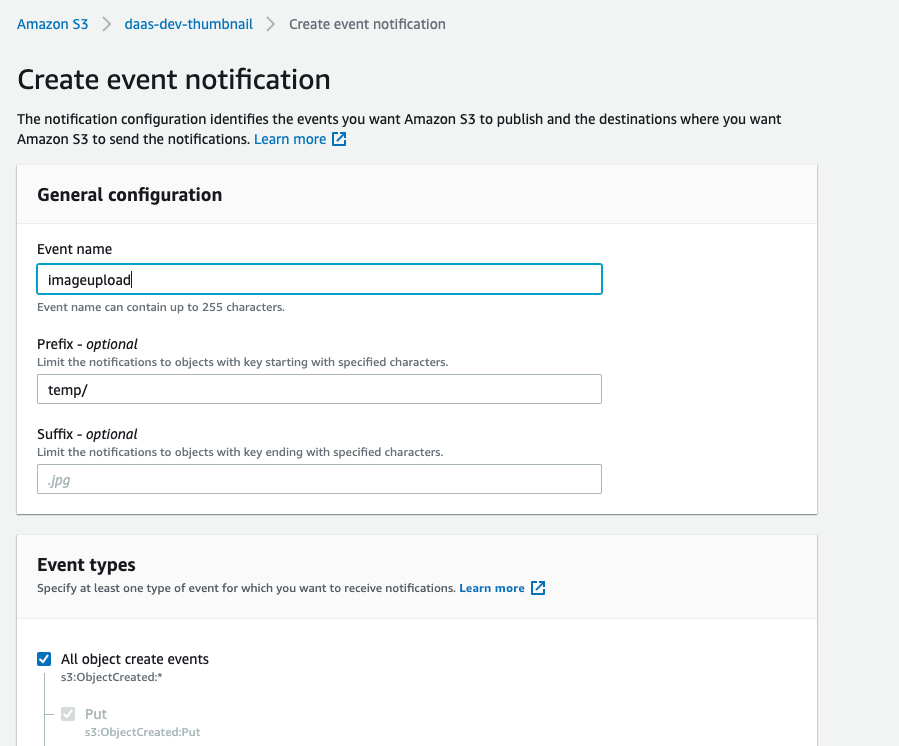
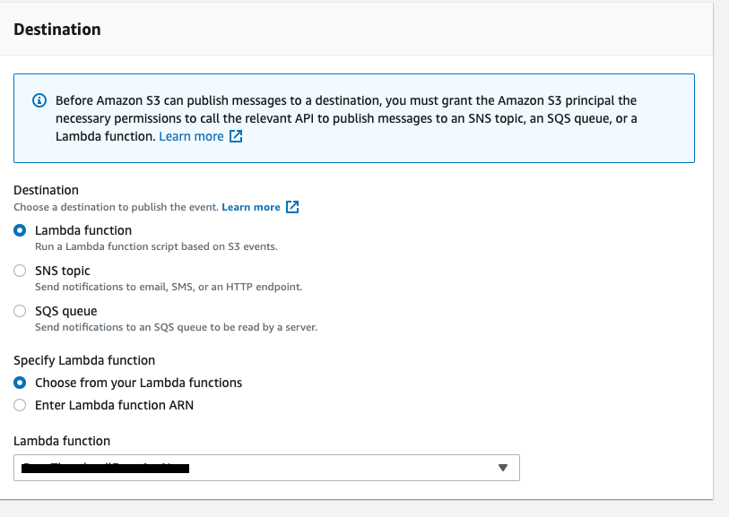
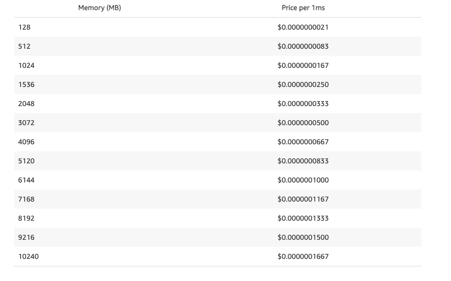
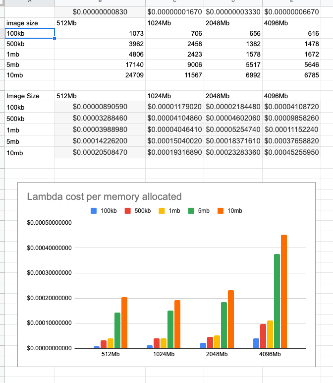

# Django-async-image-upload

This documents illustrate instruction on how to deploy cloud module of Django-async-image-upload package.


In order to deploy the cloud structure, there are 3 options you can take.

### Option 1. Use AWS SAM to automate deploy

use this option if you are going to repeatedly deploy changes to your lambda code. Also using IaC is always a good practice.

[What is the AWS Serverless Application Model (AWS SAM)?](https://docs.aws.amazon.com/serverless-application-model/latest/developerguide/what-is-sam.html)

### Option 2. Deploy using cloudformation template

This template is basically generated from previous option 1. However if you do not want to install SAM CLI and do any of the configurations, you can upload cloudformation template supplied to deploy the setup.

You need to manually upload **app.py** code to  s3 and supply to **CodeUri** of the template.

Template is in `sam/cloudformation/`  folder.

### Option 3. Manually deploy lambda, S3 and other relavant resources on your own.

You can always use this option to get your hands dirty. 👐

---

> Throughout the post, I will refer to option 1. 

## Prerequisite

You need AWS account and IAM User with appropriate permissions (if you are not familiar just use `AdministratorAccess`) 

- retrieve AWS_ACCESS_KEY_ID, AWS_SECRET_ACCESS_KEY
- configure your AWS CLI credential with `aws configure`

[Configuration basics](https://docs.aws.amazon.com/cli/latest/userguide/cli-configure-quickstart.html)

## Walkthrough

Following command install SAM on MAC OS.

```bash
$/bin/bash -c "$(curl -fsSL https://raw.githubusercontent.com/Homebrew/install/master/install.sh)"
$brew tap aws/tap
$brew install aws-sam-cli
$sam --version
> SAM CLI, version 1.15.0
```

- Refer to following link for how to install SAM CLI on other OS

    [Installing the AWS SAM CLI](https://docs.aws.amazon.com/serverless-application-model/latest/developerguide/serverless-sam-cli-install.html)

### Breakdown

Before deploying the SAM, let's take a look at some of the code to understand what's going on. you only need to take a good look at three(actually 4 - one is variation) pieces of the code - **app.p[y](http://app.py)** and **template*.yaml**. If you want to know more about the structure of SAM refer to this link for sample application

[Tutorial: Deploying a Hello World application](https://docs.aws.amazon.com/serverless-application-model/latest/developerguide/serverless-getting-started-hello-world.html)

App.py

This is an actual lambda function which will be invoked on image upload. Once you upload a image to S3, lambda will get the event notification in format of `event.json` then it will copy uploaded image from `temp/` folder and generate thumbnails and upload to `image/` folder. After that the function will send callback to backend api server for completion or failure.

Template_*.yaml

SAM templates are an extension of AWS CloudFormation templates, with some additional components that make them easier to work with. I supplied two templates incase you already a working S3 that you are using as django static storage.(you need to manually hookup event notification in this case

- **template_new_bucket.yaml** - if you don't have existing bucket, use this, it will create new bucket and hookup lambda trigger automatically.
- **template_existing_bucket.yaml** - use this if you already have a bucket, you need to manually configure lifecycle policy and lambda trigger. (we will get to this later - refer to `setup for existing bucket`)

Configure parameters appropriately.

```yaml
SourceImageBucketName:
    Type: String
    Default: thumbnail-bucket-1412312
    Description: unique name of the new bucket for presigned image uploader
  LambdaFunctionName:
    Type: String
    Default: ThumbnailFunction
    Description: Name of the lambda function
  TemporaryImagePath:
    Type: String
    Default: temp/
    Description: Folder path where presigned image uploads to (if you change this you need to change django settings - TEMPORARY_IMAGE_PATH
  MemSize:
    Type: Number
    Default: 1024
    Description: The size of the memory in MB allocated per invocation of the function.
  Policy:
    Type: String
    Default: AWSLambdaExecute
    Description: |
      One or more policies that this function needs. They will be appended to the default role for this function. if you need more info refer to https://docs.aws.amazon.com/serverless-application-model/latest/developerguide/sam-resource-function.html#sam-function-memorysize
      Note: If the Role property is set, this property is ignored.
  ExpirationInDay:
    Type: Number
    Default: 1
    Description: Lifecyfle expiration for temporary image in day

```
**env.json**

This file sets environment variables for the function code. 

- `THUMB_DIMENSION_*` - define your thumbnail dimension
- `BLUR` - generate blur images (default: True)
- `BLUR_RADIUS` - radius of GaussianBlur (default: 20)
- `IMAGE_FOLDER` - destination folder in the bucket (default "image")
- `CALLBACK_URL` - callback api for your django app. you want to change host of the addr

Once everything is set, you can build and deploy.

```yaml
#cd sam
#for local development and testing 
$sam build -t template_new_bucket.yaml --container-env-var-file env.json
# you can invoke your lambda on your dev machine. Make sure you have docker engine installed
$sam local invoke "<function name>" -e events/event.json 
$sam local generate-event s3 put --bucket <bucket> --key <key>

#deploy
$sam deploy --guided -t template_new_bucket.yaml --profile <profile> \
   --parameter-overrides ParameterKey=ParameterValue 

```

If you following prompt from deploy step, you will get successful deployment output. Go to Cloudformation on AWS console, you will be able to see two stacks deployed, if you face any error, Cloudformation will revert the deployment and delete all resources except S3 bucket.




### Setup for existing bucket

You need to make sure appropriate bucket policy and event notification is in place 

**bucket policy** 

Make sure to add following bucket policy, otherwise lambda won't be able to get object since antonymous user gets ownership of the object.

[Controlling ownership of uploaded objects using S3 Object Ownership](https://docs.aws.amazon.com/AmazonS3/latest/userguide/about-object-ownership.html)

```yaml
{
    "Version": "2012-10-17",
    "Statement": [
        {
            "Effect": "Allow",
            "Principal": "*",
            "Action": "s3:*",
            "Resource": [
                "arn:aws:s3:::daas-dev-thumbnail/*",
                "arn:aws:s3:::daas-dev-thumbnail"
            ]
        },
				{
         "Sid": "Only allow writes to my bucket with bucket owner full control",
         "Effect": "Allow",
         "Principal": "*",
         "Action": [
            "s3:PutObject"
         ],
         "Resource": "arn:aws:s3:::daas-dev-thumbnail/*",
         "Condition": {
            "StringEquals": {
               "s3:x-amz-acl": "bucket-owner-full-control"
            }
         }
      }
    ]
}
```

**event notification**

you need to add event notification on s3 create event to lambda function we deploy.

Goto S3 and click properties tab. Go to `Event notification` and click "create event notification". Fill in option as shown in the screenshot.





### Extra Note
You might need to add CORS rule for your bucket. Refer to following link.

[Using cross-origin resource sharing (CORS)](https://docs.aws.amazon.com/AmazonS3/latest/userguide/cors.html)

## Lambda Optimization

Lambda allocates CPU power in proportion to the amount of memory configured. Since image processing is mostly CPU intensive (with few exceptions) CPU power matters because duration of lambda function affects cost.  As of 2021, Price per 1ms for US East is as follows.



Assuming average mobile client device image upload is around 5~6MB, I will give you my benchmark data so you can optimize your lambda function depending on your usecases. If you use more efficient function code, you might need to get the metric yourself and find best memory for your lambda function.

(in order to avoid, cold start issue, I have ran same file 10 times and took avg of the time)

Function execute following operation

- Pillow
    - Blur - 50x50, 100x100, 400x400, Original
    - Thumbnail - 50x50, 100x100, 400x400, Original
- S3 put operation
- timeout 30sec

I have tested with image size (100Kb, 500Kb, 1Mb, 5Mb and 10Mb) with lambda memory (512Mb, 1024Mb, 2048Mb, 4096Mb)



As you can see from the graph, bigger memory is not necessarily cheaper. It can be faster but since this is async operation, I recommend to go with less cost over time consumption.

Only use this as reference and you should test with your own data and find out optimal memory for your lambda function.
